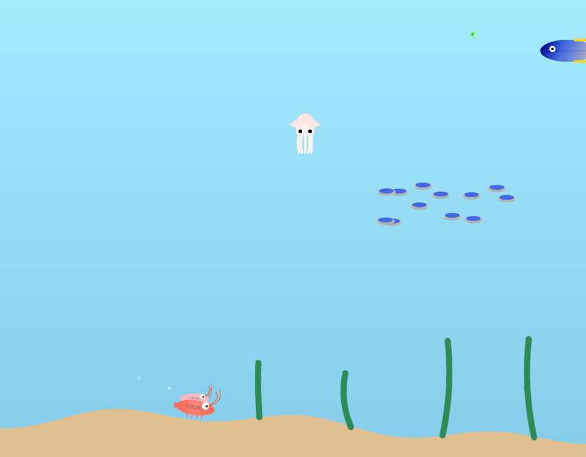

# えびちゃん（仮）

## ゲーム概要

**ジャンル**: シンプル回避アクションゲーム（距離スコア型）

操作はワンアクションのみ。
食物連鎖の最下層「エビ」を操作し、迫りくる天敵を避けながらどれだけ長く泳げるか（距離m）を競う中毒性の高いゲームです。

[👉 ゲームをプレイする](https://umaumax.github.io/ebi-game/)

## 操作方法

- **スマホ**: 画面タップ
- **PC**: スペースキー

## ライセンス
MIT

## Features
* [ ] PWA
* [ ] Xで画像付きでシェア(XのAPIキーが必要)
